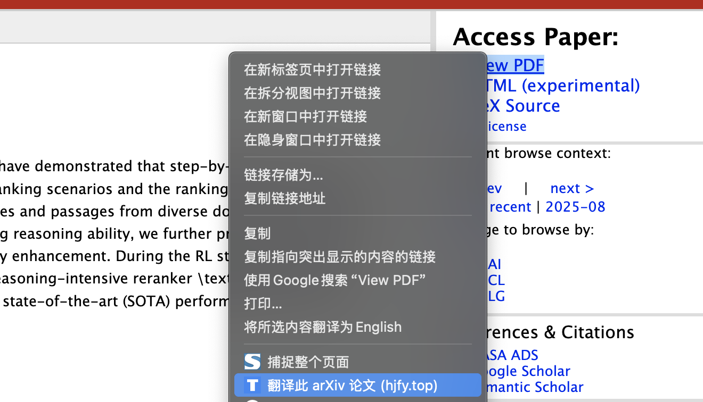
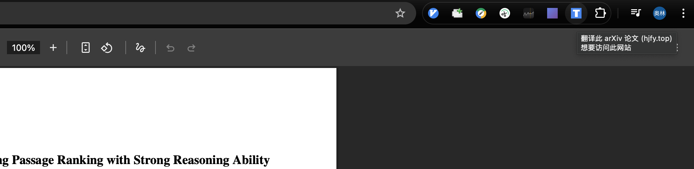

# arXiv Translator - hjfy.top

A Chrome extension that translates arXiv papers with one click, powered by [hjfy.top](https://hjfy.top).

## Features

- **Right-click menu**: Right-click on any arXiv page or arXiv link to translate the paper instantly
- **Toolbar icon**: Click the extension icon on any arXiv page (including PDF) to open the translation
- **Smart URL parsing**: Supports `/abs/`, `/pdf/`, and `/html/` arXiv URL formats, with both old and new arXiv ID schemes

## Installation

1. Download or clone this repository
2. Open `chrome://extensions/` in Chrome
3. Enable **Developer mode** (top right toggle)
4. Click **Load unpacked** and select the project folder

## Usage

### Context Menu (right-click)
Right-click on an arXiv link to see the translation option:



- On an arXiv abstract/HTML page, right-click and select **"翻译此论文 (hjfy.top)"**
- On any page, right-click an arXiv link and select **"翻译此 arXiv 论文 (hjfy.top)"**

### Toolbar Icon
Click the extension icon in the toolbar on any arXiv page (including PDF):



- Navigate to any arXiv page and click the extension icon in the toolbar
- Works on PDF pages where the context menu is unavailable

## Project Structure

```
arxiv-translator/
├── manifest.json              # Extension manifest (Manifest V3)
├── assets/
│   ├── icon16.png
│   ├── icon48.png
│   └── icon128.png
└── background/
    └── service-worker.js      # Core logic: context menu & icon click handling
```

## Permissions

| Permission | Purpose |
|---|---|
| `contextMenus` | Add translation options to the right-click menu |
| `activeTab` | Access the current tab's URL |
| `tabs` | Create new tabs for the translation page |

## License

MIT
